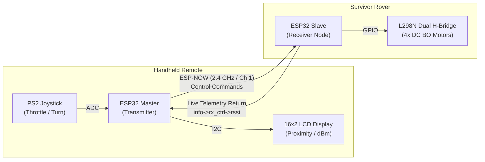

# 📡 Wi-Fi RSSI Search & Rescue Localization Rover

An autonomous/teleoperated disaster-response robotic rover designed to localize trapped victims in GPS-denied environments (e.g., collapsed structures, urban disaster zones) using 2.4 GHz RF Signal Strength (RSSI) sniffing and bidirectional ESP-NOW telemetry.

---

## 📌 Overview

During structural collapses and disaster scenarios, cellular and GPS signals are often obstructed or entirely unavailable. However, trapped survivors' personal devices (smartphones, wearables) frequently emit 2.4 GHz beacon frames. 

This project implements a dual-node robotics platform:
1. **Transmitter (Remote Controller Node):** Uses an analog dual-axis joystick to steer the vehicle and renders real-time survivor proximity metrics (`HOT`, `WARM`, `COLD`) and raw signal power (dBm) on an I2C character display.
2. **Receiver (Search & Rescue Rover Node):** A 4WD differential-drive rover equipped with an L298N dual H-bridge motor driver, power-rail brownout suppression, and a non-blocking ESP-NOW packet processor that feeds signal telemetry back to the remote at 20 Hz.

---

## ⚙️ System Architecture & Dataflow
# Survivor Rover — Control & Telemetry Flow

## System Diagram

## Signal Path Summary

| Segment | Interface | Signal |
|---|---|---|
| Joystick → ESP32 Master | ADC | Throttle / Turn input |
| ESP32 Master → ESP32 Slave | ESP-NOW (2.4 GHz, Channel 1) | Motor control commands |
| ESP32 Slave → L298N | GPIO | Motor driver signals |
| ESP32 Slave → ESP32 Master | ESP-NOW (return channel) | RSSI telemetry (`info->rx_ctrl->rssi`) |
| ESP32 Master → LCD | I2C | Proximity / signal strength (dBm) display |

## Node Details

**Handheld Remote**
- **PS2 Joystick** — reads throttle/turn analog input, sent via ADC to the Master.
- **ESP32 Master (Transmitter)** — reads joystick, transmits commands over ESP-NOW, receives telemetry, drives the LCD.
- **16x2 LCD Display** — shows live proximity/RSSI (dBm) data, driven over I2C.

**Survivor Rover**
- **ESP32 Slave (Receiver Node)** — receives ESP-NOW commands, drives the motor bridge over GPIO, sends RSSI telemetry back to the Master.
- **L298N Dual H-Bridge** — drives 4x DC gear (BO) motors based on GPIO signals from the Slave.

## 🧰 Hardware Specifications & BOM

### 1. Remote Controller Node
* **Microcontroller:** ESP32-WROOM-32 Development Board
* **Input:** PS2 Dual-Axis Analog Joystick Module (Powered strictly at 3.3V)
* **Display:** 1602 (16x2) Liquid Crystal Display with PCF8574 I2C Backpack
* **Power:** 5V USB / 1S Li-Po source

### 2. Rover Node
* **Microcontroller:** ESP32-WROOM-32 Development Board
* **Motor Driver:** L298N Dual H-Bridge Driver Module
* **Actuators:** 4x Yellow BO Geared DC Motors (3–6V rated)
* **Power Source:** 2S Li-ion Battery Pack (7.4V nominal, 8.4V peak)
* **Voltage Regulation:** LM2596 DC-DC Buck Converter (Stepped down to 5.05V for ESP32 VIN)
* **Decoupling / Inrush Buffer:** 220µF 25V Radial Electrolytic Capacitor across L298N power terminals

---

## 🔌 Wiring & Pin Configurations

### Transmitter Node (Remote)
| Component | Component Pin | ESP32 Pin | Logic Level |
| :--- | :--- | :--- | :--- |
| **PS2 Joystick** | `VCC` | `3V3` | 3.3V (ADC Safe) |
| | `GND` | `GND` | 0V |
| | `VRX` | `GPIO 34` | ADC1 Input |
| | `VRY` | `GPIO 35` | ADC1 Input |
| | `SW` | `GPIO 32` | Digital In (Pull-up) |
| **16x2 I2C LCD** | `VCC` | `VIN` | 5.0V |
| | `GND` | `GND` | 0V |
| | `SDA` | `GPIO 21` | I2C Data |
| | `SCL` | `GPIO 22` | I2C Clock (50 kHz) |

### Receiver Node (Rover)
| Component | Module Pin | ESP32 / Power Connection | Function |
| :--- | :--- | :--- | :--- |
| **L298N Driver** | `12V` | Battery (+) & LM2596 `IN+` & Cap (+) | 7.4V Motor Rail |
| | `GND` | Battery (-) & LM2596 `IN-` & ESP32 `GND` | **Common Star Ground** |
| | `IN1` | `GPIO 25` | Left Motor Forward |
| | `IN2` | `GPIO 26` | Left Motor Reverse |
| | `IN3` | `GPIO 27` | Right Motor Forward |
| | `IN4` | `GPIO 14` | Right Motor Reverse |
| | `ENA` / `ENB` | *Jumpers Shorted* | 100% PWM Drive |
| | `5V-EN` | *Jumper Shorted* | Internal Logic Rail |
| **LM2596 Buck** | `OUT+` | ESP32 `VIN` | 5.05V Regulated |
| | `OUT-` | ESP32 `GND` | Ground Reference |

---

## 📊 RSSI Proximity Classification Table

| Signal Strength (dBm) | Physical Distance | Proximity State | LCD Indication |
| :--- | :--- | :--- | :--- |
| **$-35\text{ to } -55\text{ dBm}$** | $< 2\text{ meters}$ | High Proximity / Immediate Vicinity | `[HOT]` |
| **$-56\text{ to } -75\text{ dBm}$** | $3\text{ to } 6\text{ meters}$ | Approaching Beacon | `[WARM]` |
| **$-76\text{ to } -95\text{ dBm}$** | $> 8\text{ meters}$ | Weak / Distant Signal | `[COLD]` |

---

## 🛠️ Key Engineering Challenges Solved

1. **Power Rail Inrush Voltage Sag:** Starting 4 brushed DC motors under load pulls an instantaneous stall current spike ($>1.5\text{A}$), collapsing the 7.4V battery rail down to 5.3V. This was mitigated by adding a **$220\mu\text{F}\text{ / }25\text{V}$ decoupling reservoir capacitor** across the driver terminals and routing a dedicated common star ground point.
2. **Brownout Resets (BOR):** Transients on the 3.3V core during combined RF transmission and motor commutation were handled via RTC controller register configuration (`WRITE_PERI_REG(RTC_CNTL_BROWN_OUT_REG, 0)`).
3. **Dynamic Bidirectional Pairing:** The Rover auto-detects the remote's source MAC address from incoming packet headers and dynamically registers the peer on the fly, eliminating the need to hardcode the transmitter's MAC address in the slave sketch.
4. **I2C Bus Contention:** Stabilized character rendering and eliminated display corruption on the PCF8574 LCD expander by tuning the I2C clock frequency to $50\text{ kHz}$ (`Wire.setClock(50000)`).
